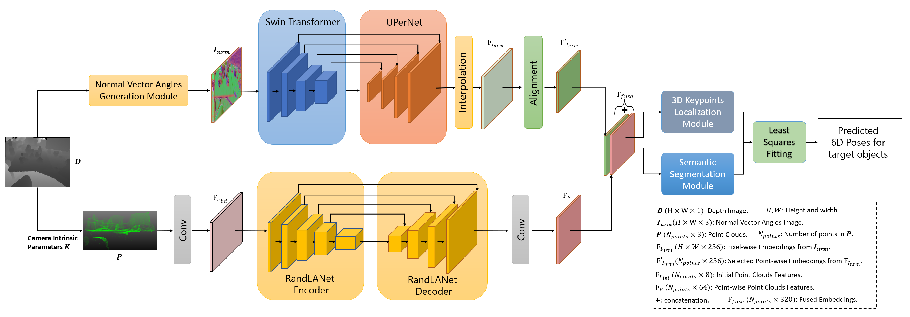

# SwinDePose. 

## Table of Contents  

- [SwinDePose](#swindepose)
  - [Table of Content](#table-of-content)
  - [Introduction & Citation](#introduction--citation)
  - [Installation](#installation)
  - [Code Structure](#code-structure)
  - [Datasets](#datasets)
  - [Training and evaluating](#training-and-evaluating)
    - [Training on the LineMOD Dataset](#training-on-the-linemod-dataset)
    - [Evaluating on the LineMOD Dataset](#evaluating-on-the-linemod-dataset)
    - [Visualizaion on the LineMOD Dataset](#demovisualizaion-on-the-linemod-dataset)
    - [Training on the Occ-LineMod Dataset](#training-on-the-occ_linemod-dataset)
    - [Evaluating on the Occ-LineMod Dataset](#evaluating-on-the-Occ-LineMod-dataset)
    - [Visualization on the Occ-LineMod Dataset](#demovisualization-on-the-Occ-LineMod-dataset)
  - [Results](#results)
  - [License](#license)

This is the official source code for the SwinDePose: Depth-based Object 6DoF Pose Estimation using Swin Transformers.
To preview the MD file, press ctrl+k+v

## Introduction & Citation
<div align=center></div>
[SwinDePose] is a general framework for representation learning from a depth image, and we applied it to the 6D pose estimation task by cascading downstream prediction headers for instance semantic segmentation and 3D keypoint voting prediction from FFB6D.

Before the representation learning stage of SwinDePose, we build **normal vector angles image generation** module to generate normal vector angles images from depth images. Besides, depth images are lifted to point clouds by camera intrinsic parameters K. Then, the normal vector angles images and point clouds are fed into images and point clouds feature extraction networks to learn representations. Moreover, the learned embeddings from normal vector angles images and point clouds are fed into 3D keypoints localization module and instance segmentation module. Finally, a least-squares fitting manner is applied to estimate 6D poses. 

## Installation - From docker 
- Pull docker image from docker hub
```bash 
docker pull zhujunli/swin-pose
```
- Run our swin-pose docker
```bash 
sudo nvidia-docker run --gpus all --ipc=host --shm-size 50G --ulimit memlock=-1 --name swin-ffb -it --rm -v your_workspace_directory:/workspace zhujunli/swin-pose
```

## Code Structure

<details>
  <summary>[Click to expand]</summary>

- **swin_de_pose**
  - **swin_de_pose/apps**
    - **swin_de_pose/apps/train_lm.py**: Training & Evaluating code of SwinDePose models for the LineMOD dataset.
    - **swin_de_pose/apps/train_occlm.py**: Training & Evaluating code of SwinDePose models for the Occ-LineMOD dataset.
  - **swin_de_pose/config**
    - **swin_de_pose/config/common.py**: Some network and datasets settings for experiments.
    - **swin_de_pose/config/options.py**: Training and evaluating parameters settings for experiments.
  - **swin_de_pose/scripts**
    - **swin_de_pose/scripts/train_lm.sh**: Bash scripts to start the traing on the LineMOD dataset.
    - **swin_de_pose/scripts/test_lm.sh**: Bash scripts to start the testing on the LineMOD dataset.
    - **swin_de_pose/scripts/train_occlm.sh**: Bash scripts to start the training on the Occ-LineMOD dataset.
    - **swin_de_pose/scripts/test_occlm.sh**: Bash scripts to start the testing on the Occ-LineMOD dataset.
  - **swin_de_pose/datasets**
    - **swin_de_pose/datasets/linemod/**
      - **swin_de_pose/datasets/linemod/linemod_dataset.py**: Data loader for LineMOD dataset.
      - **swin_de_pose/datasets/linemod/create_angle_npy.py**: Generate normal vector angles images for real scene Linemod datset.
    - **swin_de_pose/datasets/occ_linemod**
      - **swin_de_pose/datasets/occ_linemod/occ_dataset.py**： Data loader for Occ-LineMOD dataset.
      - **swin_de_pose/datasets/occ_linemod/create_angle_npy.py**：Generate normal vector angles images for Occ-Linemod datset.
  - **swin_de_pose/mmsegmentation**: packages of swin-transformer.
  - **swin_de_pose/models**
    - **swin_de_pose/models/SwinDePose.py**: Network architecture of the proposed SwinDePose.
    - **swin_de_pose/models/cnn**
      - **swin_de_pose/models/cnn/extractors.py**: Resnet backbones.
      - **swin_de_pose/models/cnn/pspnet.py**: PSPNet decoder.
      - **swin_de_pose/models/cnn/ResNet_pretrained_mdl**: Resnet pretraiend model weights.
    - **swin_de_pose/models/loss.py**: loss calculation for training of FFB6D model.
    - **swin_de_pose/models/pytorch_utils.py**: pytorch basic network modules.
    - **swin_de_pose/models/RandLA/**: pytorch version of RandLA-Net from [RandLA-Net-pytorch](https://github.com/qiqihaer/RandLA-Net-pytorch)
  - **swin_de_pose/utils**
    - **swin_de_pose/utils/basic_utils.py**: basic functions for data processing, visualization and so on.
    - **swin_de_pose/utils/meanshift_pytorch.py**: pytorch version of meanshift algorithm for 3D center point and keypoints voting.
    - **swin_de_pose/utils/pvn3d_eval_utils_kpls.py**: Object pose esitimation from predicted center/keypoints offset and evaluation metrics.
    - **swin_de_pose/utils/ip_basic**: Image Processing for Basic Depth Completion from [ip_basic](https://github.com/kujason/ip_basic).
    - **swin_de_pose/utils/dataset_tools**
      - **swin_de_pose/utils/dataset_tools/DSTOOL_README.md**: README for dataset tools.
      - **swin_de_pose/utils/dataset_tools/requirement.txt**: Python3 requirement for dataset tools.
      - **swin_de_pose/utils/dataset_tools/gen_obj_info.py**: Generate object info, including SIFT-FPS 3d keypoints, radius etc.
      - **swin_de_pose/utils/dataset_tools/rgbd_rnder_sift_kp3ds.py**: Render rgbd images from mesh and extract textured 3d keypoints (SIFT/ORB).
      - **swin_de_pose/utils/dataset_tools/utils.py**: Basic utils for mesh, pose, image and system processing.
      - **swin_de_pose/utils/dataset_tools/fps**: Furthest point sampling algorithm.
      - **swin_de_pose/utils/dataset_tools/example_mesh**: Example mesh models.
  - **swin_de_pose/train_log**
    - **swin_de_pose/train_log/**
      - **swin_de_pose/train_log/{your experiment name}/checkpoints/**: Storing trained checkpoints on your experiment.
      - **swin_de_pose/train_log/{your experiment name}/eval_results/**: Storing evaluated results on your experiment.
      - **swin_de_pose/train_log/{your experiment name}/train_info/**: Training log on your experiment.
- **figs/**: Images shown in README.

</details>

## Datasets
- ### Download real and prepare synthetic LineMod Dataset 
  - Download the preprocessed LineMOD dataset from [onedrive link](https://hkustconnect-my.sharepoint.com/:u:/g/personal/yhebk_connect_ust_hk/ETW6iYHDbo1OsIbNJbyNBkABF7uJsuerB6c0pAiiIv6AHw?e=eXM1UE) or [google drive link](https://drive.google.com/drive/folders/19ivHpaKm9dOrr12fzC8IDFczWRPFxho7) (refer from [DenseFusion](https://github.com/j96w/DenseFusion)). Unzip it and link the unzipped ``Linemod_preprocessed/`` to ``ffb6d/datasets/linemod/Linemod_preprocessed``:
  ```shell
  ln -s path_to_unzipped_Linemod_preprocessed ffb6d/dataset/linemod/
  ```
- ### Generate LindMod Normal Vector Angles Images 
  - For **synthetic** dataset:
  0. Generate rendered and fused data following [raster_triangle](https://github.com/ethnhe/raster_triangle).
  1. Open raster_triangle folder. Replace its fuse.py to swin_de_pose/fuse.py and rgbd_renderer.py to swin_de_pose/rgbd_renderer.py. 
  2. Link the Linemod to the current folder. 
        ```bash 
        ln -s path_to_Linemod_preprocessed ./Linemod_preprocessed
        ```
      Don't have to do it every time. 
  3. Render renders_nrm/ data. For example, for phone class.
      ```bash 
      python3 rgbd_renderer.py --cls phone --render_num 10000
      ```
  4. Render fuse_nrm/ data. For example, for phone class.
      ```bash 
      python3 fuse.py --cls phone --fuse_num 10000
      ```
  - For **real** dataset: Open swin_de_pose/datasets/linemod/
    ```bash 
    python -m create_angle_npy.py --cls_num your_cls_num --train_list 'train.txt' --test_list 'test.txt'
    ```
- ### Download Occ-LindMod Dataset
  - Download the BOP Occ-LineMOD dataset from (https://bop.felk.cvut.cz/datasets/)
- ### Generate Occ-LindMod Normal Vector Angles Images 
  - For both **pbr_synthetic** and **real** dataset: Open swin_de_pose/datasets/occ_linemod/
    ```bash 
    python -m create_angle_npy.py --cls_num your_cls_num --train_list 'train.txt' --test_list 'test.txt'
    ```

## Training and evaluating
### Training on the LineMOD Dataset
- Train the model for the target object.
      ```bash 
      sh scripts/train_lm.sh
      ```
    The trained checkpoints are stored in ``experiment_name/train_log/linemod/checkpoints/{cls}/``.
### Evaluating on the LineMOD Dataset
- Start evaluation by:
      ```bash 
      sh scripts/test_lm.sh
      ```
  You can evaluate different checkpoint by revising ``tst_mdl`` to the path of your target model.
- **Pretrained model**: We provide our pre-trained models for each object on onedrive, [link](). Download them and move them to their according folders. For example, move the ``ape_best.pth.tar`` to ``train_log/linemod/checkpoints/ape/``. Then revise ``tst_mdl=train_log/linemod/checkpoints/ape/ape_best.path.tar`` for testing.
### Visualizaion on the LineMOD Dataset
- After training your models or downloading the pre-trained models, you can visualizing the results:
      ```bash 
      sh scripts/test_lm_vis.sh
      ```

### Training on the Occ-LineMOD Dataset
- Train the model for the target object.
      ```bash 
      sh scripts/train_occlm.sh
      ```
    The trained checkpoints are stored in ``experiment_name/train_log/occ_linemod/checkpoints/{cls}/``.
### Evaluating on the Occ-LineMOD Dataset
- Start evaluation by:
      ```bash 
      sh scripts/test_occlm.sh
      ```
  You can evaluate different checkpoint by revising ``tst_mdl`` to the path of your target model.
- **Pretrained model**: We provide our pre-trained models for each object on onedrive, [link](). Download them and move them to their according folders. 
### Visualizaion on the Occ-LineMOD Dataset
- After training your models or downloading the pre-trained models, you can visualizing the results:
      ```bash 
      sh scripts/test_occlm_vis.sh
      ```